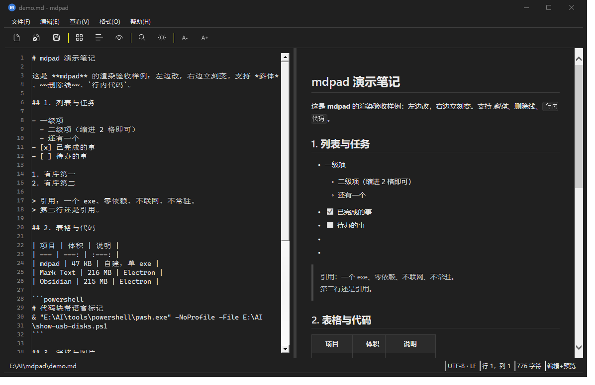
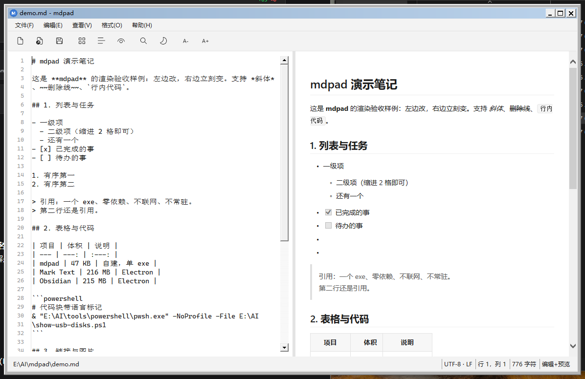
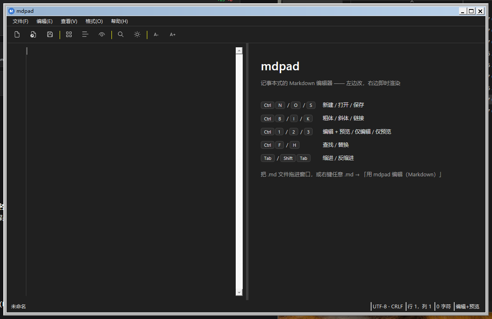

<div align="center">
  
  <h1>mdpad</h1>
  <p><b>记事本式的 Markdown 编辑器</b>：左边改，右边即时渲染。<br>
  单个 exe（约 70 KB）、零依赖、不联网、不常驻。</p>
</div>



## 为什么造它

- **Windows 11 自带记事本（11.2607）的 Markdown 支持只是「语法视图」** —— 能把 `#` 渲染成标题样式，但**不能用来编辑 Markdown**；
- 现成的替代品都不轻：Mark Text / Obsidian 都是 Electron，单 exe **225 MB** 起；
- 于是自建一个**和记事本一样小、一样快，但能改 Markdown 并即时看到渲染**的东西。

## 特性

| 分类 | 内容 |
| --- | --- |
| **编辑** | 左编辑 / 右实时预览（380 ms 防抖）、行号槽、查找替换（含全部替换）、Tab 多行缩进、格式菜单（标题/粗斜/删除线/行内码/代码块/引用/列表/任务/链接/图片/表格/分割线）、撤销、字号缩放 |
| **视图** | 编辑+预览 / 仅编辑 / 仅预览（`Ctrl+1/2/3`）、分隔条可拖动、自动换行、状态栏 |
| **界面** | Win11 原生质感：标题栏 **Mica 材质** + 沉浸式深色、命令栏/状态栏用系统配色、**Segoe Fluent Icons** 图标、Segoe UI Variable Text 字体；浅色/深色/跟随系统三态，**滚动条也跟随**；空文档显示快捷键引导页 |
| **文件** | 新建/打开/保存/另存为、拖放打开、命令行参数（可关联 `.md` 双击）、编码自动识别（UTF-8 BOM / UTF-8 / GBK）、换行风格 CRLF·LF 保持、外部修改检测与重载、最近文件 |
| **配置** | `%APPDATA%\mdpad\config.ini`（字号、视图、主题、分隔条位置、窗口尺寸、最近文件） |

| 浅色主题 | 空文档引导页 |
| --- | --- |
|  |  |

## 快速开始

### 1. 便携运行

```
mdpad.exe                 # 空窗口
mdpad.exe 笔记.md          # 直接打开
```

也可以把 `.md` 文件直接拖进窗口。

### 2. 装进系统（快捷方式 + 右键菜单）

```
& "E:\AI\tools\powershell\pwsh.exe" -NoProfile -File tools\install-shell.ps1
```

装好后你会得到：开始菜单/桌面「mdpad」快捷方式、右键任意 `.md` 的「用 mdpad 编辑（Markdown）」、
以及「打开方式」里的条目。**只动 HKCU 和用户目录，不需要管理员。**

> ⚠️ **Win11 的旧式右键项在「显示更多选项」里**（`Shift+F10`），这是系统行为。

### 3. 设为 `.md` 的默认程序

右键任意 `.md` → 打开方式 → 选择其他应用 → **mdpad（Markdown 编辑器）** → 勾选「始终」。
（默认程序的 `UserChoice` 有哈希保护，脚本改不了，只能点这一下。）

### 关于 SmartScreen（为什么仓库里有个 `.vbs`）

`mdpad.exe` 没有代码签名，**从资源管理器直接双击会弹「Windows 已保护你的电脑 / 发布者未知」**。

自签名证书**解决不了**这个问题（SmartScreen 的云端信誉检查照拦），而且会额外引入每次启动的
「打开文件-安全警告」。所以这里采用另一条路：

```
快捷方式/右键菜单  →  微软签名的 wscript.exe  →  mdpad.vbs（WshShell.Exec = CreateProcess）→  mdpad.exe
```

被双击的对象是微软签名的 `wscript.exe`，外壳的信誉检查根本不参与，**零签名、零安装**。
（注意必须用 `Exec` 而不是 `Run`：`Run` 走 ShellExecute，会做附件/区检查。）

## 快捷键

| 快捷键 | 作用 |
| --- | --- |
| `Ctrl+N` / `Ctrl+O` / `Ctrl+S` / `Ctrl+Shift+S` | 新建 / 打开 / 保存 / 另存为 |
| `Ctrl+B` / `Ctrl+I` / `Ctrl+K` / `Ctrl+E` | 粗体 / 斜体 / 链接 / 行内代码 |
| `Ctrl+F` / `Ctrl+H` | 查找 / 替换（`Enter` 找下一个，`Esc` 关闭） |
| `Ctrl+1` / `Ctrl+2` / `Ctrl+3` | 编辑+预览 / 仅编辑 / 仅预览 |
| `Ctrl+=` / `Ctrl+-` / `Ctrl+0` | 放大 / 缩小 / 重置字号 |
| `Tab` / `Shift+Tab` | 缩进 / 反缩进（多行选择一起缩） |
| `F5` | 重新载入（文件被外部改过时用） |

## 支持的 Markdown 语法

标题（`#` 与 `===` 两种）、粗体、斜体、删除线、行内代码、围栏代码块（带语言标记）、引用、
有序/无序列表（可嵌套）、任务列表、表格（含 `:---:` 对齐）、分割线、链接、图片（**本地相对路径自动解析**）、
裸链接自动识别，以及一小撮内联 HTML 白名单（`<br> <u> <b> <i> <sup> <sub> <mark> <kbd>` 等）。
单换行默认渲染为换行（`查看 → 保留单换行` 可关）。

**不支持**：Mermaid、数学公式、脚注、定义列表 —— 要看这些请用 QuickLook（空格预览）或 Mark Text。

## 从源码构建

```
build.cmd                # 产出 mdpad.exe（约 70 KB）
```

- 编译器：优先用 VS 2022 / Build Tools 自带的 **Roslyn `csc.exe`**，没有就退回 .NET Framework 4.x 的 `csc.exe`（C# 5 也能编过）
- 源码是 **UTF-8 无 BOM**，所以必须带 `-codepage:65001`，否则中文界面会变乱码
- 依赖：只有 .NET Framework 4.x + 系统自带的 WebBrowser 控件，**没有 NuGet、没有第三方库**

```
src\MainForm.cs          窗体：布局 / 主题 / 工具栏 / 文件 / 查找 / 设置
src\MarkdownRenderer.cs  自写 Markdown → HTML 渲染器（无第三方解析库）
src\EditorBox.cs         带滚动通知的 TextBox + 行号槽控件
src\Program.cs           入口、全局异常日志、IE11 渲染模式
src\app.manifest         PerMonitorV2 DPI 感知
tools\make-icon.ps1      生成多尺寸真彩 mdpad.ico（Fluent 风格，BMP 帧）
tools\install-shell.ps1  安装快捷方式 / 右键菜单 / 图标
```

## 已知边界

- **预览用系统 WebBrowser（IE 内核）**：不支持 Mermaid、数学公式与复杂 CSS/ES6；换来的是零依赖、单文件、秒开
- **超大文件**（> 10 MB）预览会变慢 → `Ctrl+2` 切到仅编辑
- **不做多标签页、不做文件树** —— 保持「记事本」定位
- 本项目开发机上出现过「创建窗口句柄时出错」的启动崩溃：该环境在窗体首次显示时的控件句柄创建会失败，
  已在构造函数里用 `ForceHandles()` 提前建好整棵控件树的句柄绕过，并把所有外观类操作包了 try/catch

## 开发中踩过的坑（值得一看）

1. **不要用 uxtheme 的未公开序号**（`#135 SetPreferredAppMode` / `#133 AllowDarkModeForWindow`）：
   序号随 Windows 版本漂移，实测在某 build 上调用后 **EDIT 控件再也建不出句柄**。滚动条暗色只用公开的
   `SetWindowTheme(hwnd, "DarkMode_Explorer", null)`（IE 的滚动条是 MSHTML 的子窗口，需枚举 `ScrollBar` 类补刷）。
2. **同一时刻重复设 `WebBrowser.DocumentText` 会让 IE 不触发 `DocumentCompleted`**（表现：预览窗空白）
   → 导航加幂等守卫 + 兜底定时器。
3. **`Control.CreateControl()` 对不可见子控件是跳过的** —— 窗体显示前想预建句柄必须直接访问 `.Handle`。
4. **保存带 BOM 的文件要用 `GetPreamble()` 显式写入**，`Encoding.GetBytes` 不含前导码。
5. **`TextBox` 没有 `SelectionChanged` / `Find`**（那是 RichTextBox 的），查找得用 `string.IndexOf`。
6. 图标 **不要用 PNG 压缩帧**：资源管理器桌面快捷方式的图标提取路径不认，全部写成 BMP(DIB) 帧。

## 许可证

[MIT](LICENSE)
